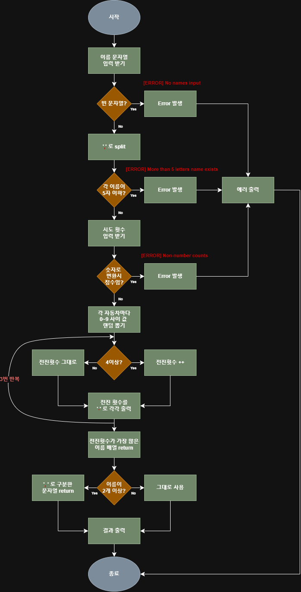

# 프리코스 2주차: 자동차 경주
## 구현 기능 정리


<br>

- [ ] 1. **참가자 입력 받기**
    - [ ] 이름 입력 받기 `Console.readLineAsync(query)`
    - [ ] 입력값 검증 (빈 문자열?)
    - [ ] return **입력값** 

<br>

- [ ] 2. **이름 추출**
    - [ ] `,`로 `split`
    - [ ] 결과 배열 검증 (각 요소가 5자 이하?)
    - [ ] return **이름 배열**

<br>

- [ ] 3. **시도 횟수 입력 받기**
    - [ ] 입력값 검증 (숫자로 변환 시 isNumber?)
    - [ ] return 시도 횟수

<br>

- [ ] 4. **각각 전진하기 (3회 반복)**
    - [ ] 각 사용자마다 전진횟수 0으로 초기화
    - [ ] 각 사용자마다 값 뽑기 `Random.pickNumberInRange(0. 9)`
    - [ ] 각각 4이상이면 전진횟수`++`
    - [ ] N회 전진 후, 결과 출력 `Console.print(message)`

<br>

- [ ] 5. **우승자 정하기**
    - [ ] 전진횟수가 max인 사람들 뽑기
    - [ ] return **우승자 배열**

<br>

- [ ] **우승자 출력하기**
    - [ ] 배열 길이가 1이면 단독 우승자, 아니면 공동 우승자
    - [ ] 공동 우승자 일 경우, return에 `join(', ')` 사용
    - [ ] 우승자 문자열 만들기
    - [ ] 우승자 출력 `Console.print(message)`

<br />


## 프로그래밍 요구 사항

<br />

## 아키텍처 - MVC + FSD 원칙 참고
```
|- controllers/
|      |- Race.js
|
|- models/
|   |- RacingLogics.js
|   |- utils/
|       |- validate.js
|       |- constants.js
|
|- views/
|    |- Input.js
|    |- Output.js
|    |- utils/
|         |- validate.js
|         |- constants.js
____________________________
```

<br />

## 테스트

**[CUSTOM ERROR]**  
- 입력받은 이름 문자열이 빈 문자열이면  
`[ERROR] No names input`

<br>

- 5자 이하인 이름이 존재하면  
`[ERROR] More than 5-letter name exists`

<br>

- 입력받은 시도횟수가 숫자가 아니면  
`[ERROR] Non-number counts`

<br />

## 참고자료
- [라이브러리 분석 결과](https://quirky-streetcar-a17.notion.site/mission-utils-28c523184d3c80d8904fe0870e5e4181?pvs=74)

- [JS Style Guide]()

- [Git Commands](https://quirky-streetcar-a17.notion.site/Git-Commands-295523184d3c80babea4d5f7cd4daff8)

- [Commit Messages](https://quirky-streetcar-a17.notion.site/Commit-message-295523184d3c80d9a241fc93c59ebce5)
- [1주차 피드백 내용]()

- [Jest 사용법]()

- [FSD principles]()